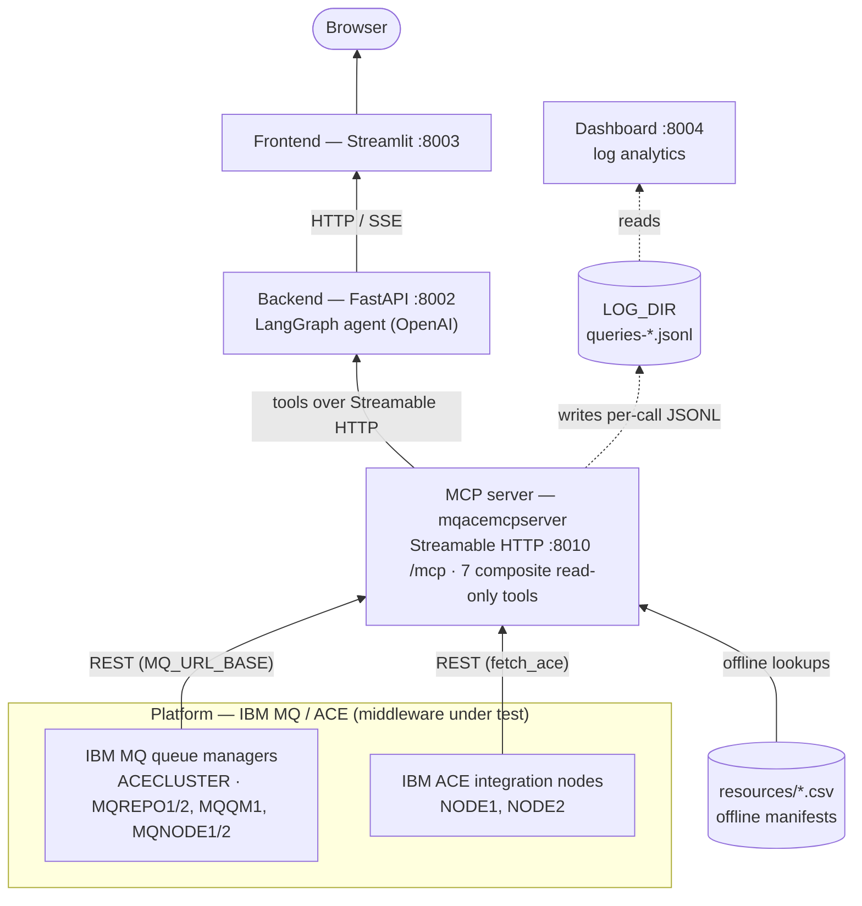
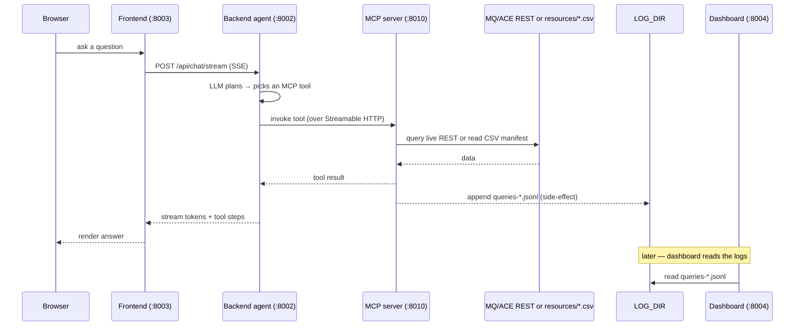

# Design — how the apps work together

This repo is a vertical stack: real **IBM MQ / ACE** middleware at the bottom, a
read-only **MCP server** that inspects it, a **backend** agent that drives the MCP
tools with an LLM, and a **frontend** chat UI on top. A **dashboard** sits to the
side, observing the MCP server's logs.

`SETUP.md` covers *how to run* each piece — this doc covers *how they fit together*.

## Overview

The main request path is the solid chain **MQ/ACE → MCP → Backend → Frontend →
Browser**. The dashed path is a side channel: the MCP server logs every tool call,
and the dashboard reads those logs — it is **not** in the request path.

## Layers

### Platform — IBM MQ + ACE
The middleware the tools actually diagnose, provisioned by `platform_build/`:
- **`platform_build/mqsetup/`** — creates the queue managers in cluster
  `ACECLUSTER` (`MQREPO1`:1414, `MQQM1`:1415, `MQREPO2`:1416, `MQNODE1`:1420,
  `MQNODE2`:1421), all on `localhost` for a single host.
- **`platform_build/acesetup/`** — creates ACE integration nodes `NODE1` / `NODE2`
  (each tied to `MQNODE1` / `MQNODE2`) and deploys the demo BAR files.

This layer is optional for development — the MCP tools also answer from the
offline CSV manifests in `resources/`.

### MCP server — `mqacemcpserver/` (Streamable HTTP `:8010` `/mcp`)
A read-only Model Context Protocol server exposing **7 composite "single-call"
tools**: `mq_queue_inspect`, `mq_channel_inspect`, `mq_host_overview`,
`ace_node_overview`, `ace_server_explore`, `ace_search`, `get_cert_details`.
- Talks to **MQ** over its REST API (`MQ_URL_BASE`) and to **ACE** via `fetch_ace`.
- Reads **offline manifests** in `resources/` (`qmgr_dump`, `node_dump`,
  `node_config`, `cert_dump`) for discovery / offline lookups.
- Enforces safety in-process: hostname allow-list, read-only MQSC, sanitised errors.
- Writes one JSONL line per tool call to `LOG_DIR` (`queries-*.jsonl`) — the
  dashboard's data source.

### Backend — `backend/` (FastAPI `:8002`)
The agent that turns natural language into MCP tool calls:
- A LangGraph `create_react_agent` (`ChatOpenAI` + `MemorySaver` for per-thread
  memory) in `backend/agent.py`.
- Loads the MCP tools over **Streamable HTTP** (transport selectable via
  `MCP_TRANSPORT`) using `langchain_mcp_adapters.MultiServerMCPClient`
  pointed at `MCP_SSE_URL` (`backend/mcp_client.py`).
- Endpoints: `/api/health`, `/api/mcp/servers`, `/api/mcp/connect`,
  `/api/chat/stream` (Server-Sent Events), `/api/chat/reset`.
- MCP-server-agnostic — no tool names hardcoded; retarget by changing `MCP_SSE_URL`.

### Frontend — `frontend/` (Streamlit `:8003`)
The chat UI:
- Calls the backend **server-side** with `httpx` at `MCP_BACKEND_URL`
  (`frontend/client.py`) and streams `/api/chat/stream`.
- All header text, scope hint, and tool catalog come from the backend's
  `/api/health` — the UI itself knows nothing about MQ/ACE.

### Dashboard — `dashboard/` (`:8004`)
A side observer, not part of the chat path:
- Reads the MCP server's `LOG_DIR` (`queries-*.jsonl`) and renders metrics.
- Imports the MCP build's `server.config` (via `MCP_SERVER_DIR`) for TLS + log-dir.
- Renders one tab per configured server, plus a static **Questions** tab.

## Request lifecycle

## Ports & endpoints

| Component | Bind | Notes |
| --- | --- | --- |
| MCP server | `:8010` (Streamable HTTP) | `/mcp`, `/healthz` (legacy `/sse` if `MCP_TRANSPORT=sse`) |
| Backend | `:8002` | `/api/health`, `/api/chat/stream`, `/api/chat/reset`, `/api/mcp/*` |
| Frontend | `:8003` | Streamlit UI |
| Dashboard | `:8004` | `/dashboard`, `/healthz` |
| MQ queue managers | `1414` / `1415` / `1416` / `1420` / `1421` | MQREPO1 / MQQM1 / MQREPO2 / MQNODE1 / MQNODE2 |

## Data sources

- **Live** — MQ via REST (`MQ_URL_BASE`) and ACE via its admin REST API; needs the
  `platform_build/` middleware running.
- **Offline** — CSV manifests in `resources/` (refreshed by a daily extract job),
  so the tools answer discovery/lookup questions with no live system.

TLS on the MCP HTTP endpoint uses **self-signed certs** in `certs/` for local dev
(`verify=False`), and the demo cluster/cert data targets **`localhost`** so the
whole stack runs on one host.

See [`SETUP.md`](SETUP.md) to run it all, and each app's `README.md` for per-component detail.
